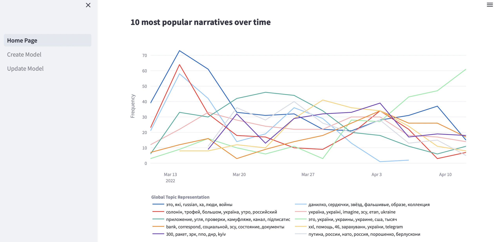
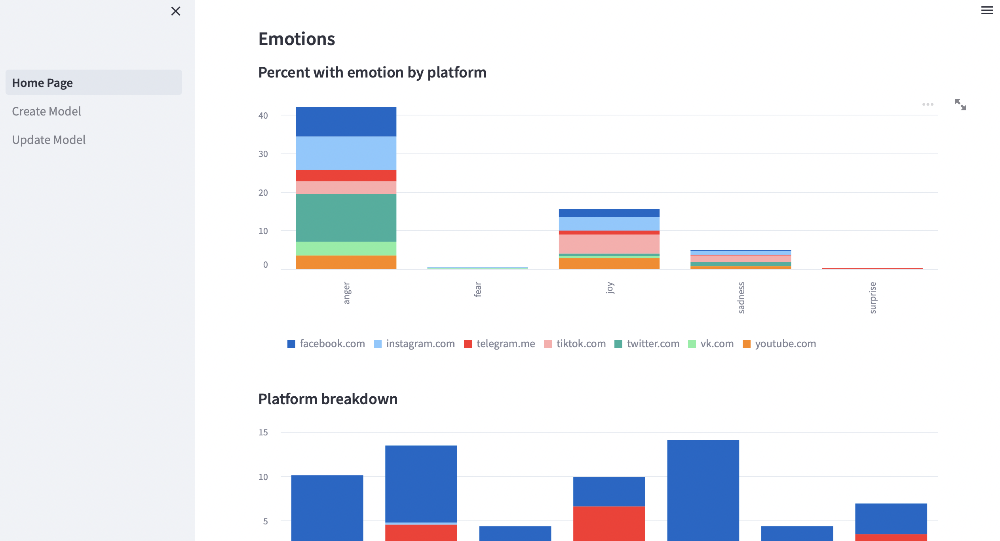
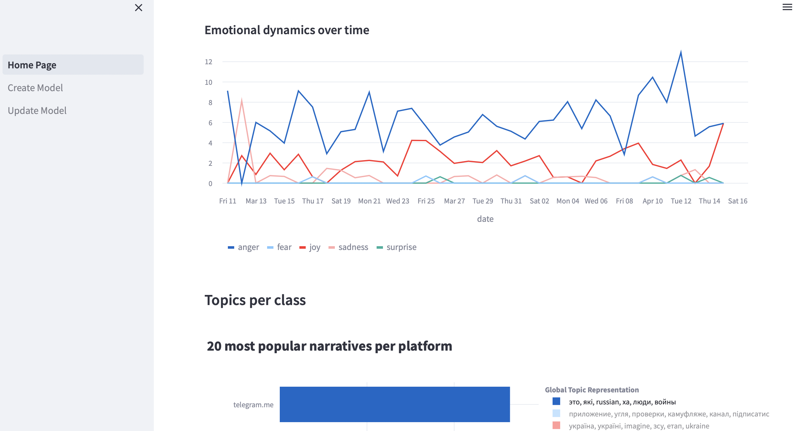

# BoardTopic

Welcome to BoardTopic, a friendly way to understand your big data.

BoardTopic uses state-of-the-art frameworks for topic modeling ([BERTopic](https://maartengr.github.io/BERTopic/algorithm/algorithm.html) and fine-tuned large language models from [:hugs: Hugging Face](https://huggingface.co) to help you analyze and makes sense of your data, no coding required.  


